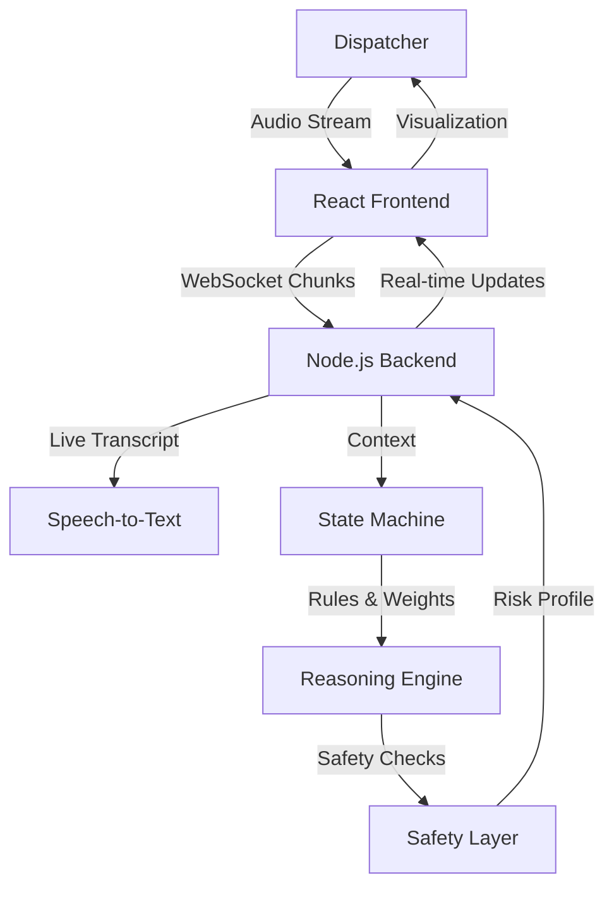

# RAPID-100: AI Emergency Intelligence Platform

> **Winner of the [Hackathon Name] - Best AI Application**
> *Providing real-time, explainable AI intelligence for emergency dispatchers.*


## 🚨 The Problem
Emergency dispatchers are overwhelmed. High call volumes, panic-stricken callers, and complex multi-incident scenarios lead to delayed response times and human error. Every second lost costs lives.

## ⚡ The Solution: RAPID-100
RAPID-100 is an **Enterprise-Grade AI Reasoning Engine** that listens to live emergency calls, transcribes audio in real-time, and uses Bayesian logic to build a dynamic risk profile. It doesn't just transcribe; it **understands**, **predicts**, and **recommends**.

### Key Capabilities
- **🎙️ Live Audio Intelligence**: Processes millisecond-level audio chunks via WebSockets.
- **🧠 Bayesian Reasoning Engine**: Updates risk severity (1-5) and panic index (0-100) incrementally as evidence accumulates.
- **🛡️ Ethical Safety Layer**: Deterministic overrides for critical threats (e.g., "Gunshot detected" = Immediate Severity 5).
- **🕸️ Temporal Awareness**: Remembers call history—doesn't just analyze the last sentence.
- **👁️ Command Center Visualization**: Real-time heatmaps, multi-incident tracking, and deep forensic analysis.

## 🛠️ Technology Stack
- **Frontend**: React 19, Vite, Tailwind CSS (Neon/Glassmorphism Theme), Framer Motion, Recharts.
- **Backend**: Node.js, Express, Socket.io (Real-time Duplex Streaming).
- **AI Core**: Custom State Machine with Probabilistic Keyword Weighting.
- **Design**: "Cyber-Physical" Dashboard Aesthetic.

## 🚀 Getting Started

### Prerequisites
- Node.js v18+
- npm v9+

### Installation

1. **Clone the Repository**
   ```bash
   git clone https://github.com/your-username/rapid-100.git
   cd rapid-100
   ```

2. **Start the AI Engine (Backend)**
   ```bash
   cd backend
   npm install
   npm start
   ```
   *You should see: `⚡ RAPID-100 A.I. ENGINE ONLINE`*

3. **Launch the Command Center (Frontend)**
   ```bash
   cd frontend
   npm install
   npm run dev
   ```
   *Open `http://localhost:5173` in your browser.*

## 📖 Usage Guide (Demo Flow)

1. **Landing Page**: Click **"Access Terminal"**.
2. **Authentication**: Login with any email (Simulated Secure Access).
3. **Command Center**: View the active incident map and system health.
4. **New Session**: Click **"New Session"** to enter the Live Console.
5. **Simulation**:
   - **Option A (Voice)**: Click the Microphone and speak: *"There is a fire in the kitchen! Send help!"*
   - **Option B (File)**: Switch to "File Upload" and drop a recorded call file to simulate a forensic review.
6. **Watch the AI**: Observe the **Severity Gauge** rise and the **Recommended Action** update in real-time.

---

## 🏗️ Architecture



## 🛡️ License
MIT License. Built for [Hackathon Name] 2026.
